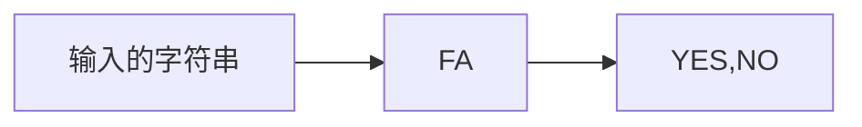
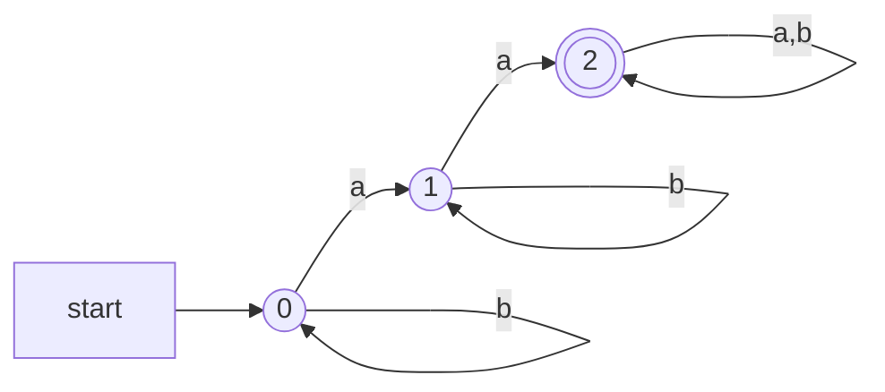
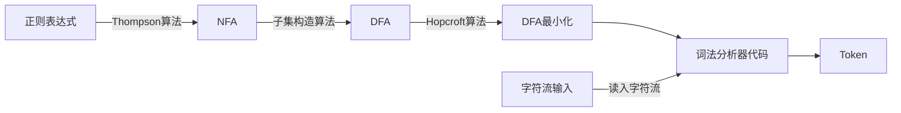

[TOC]

> 编译原理入门：
>
> 概念：
>
> 简单实现
>
> 编译原理初级：
>
> 编译原理中级
>
> 编译原理高级


[编译原理知识汇总 - 简书 (jianshu.com)](https://www.jianshu.com/p/eb63d31ad638)

[(88条消息) 编译原理总结，看这一篇就够了！_LeeDuo.的博客-CSDN博客_编译原理](https://blog.csdn.net/LeeDuoZuiShuai/article/details/104882488)

[编译原理 - sweetyu - 博客园 (cnblogs.com)](https://www.cnblogs.com/sweetyu/p/4947030.html)

[(88条消息) 编译原理_不是很呆D的博客-CSDN博客_编译原理](https://blog.csdn.net/qq_36459481/article/details/90937809)

[编译原理 - mathor (wmathor.com)](https://wmathor.com/index.php/category/编译原理/2/)


# 第一章 编译概述

## 一.翻译程序的三种方式

1.编译：将高级语言编写的源程序翻译成等价的机器语言或汇编语言。
2.解释：将高级语言编写的源程序翻译一句执行一句，不生成目标文件，直接执行源代码文件。
3.汇编：用汇编语言编写的源程序翻译成与之等价的机器语言。


**解释器与编译器的主要区别:**运行目标程序时的控制权在`解释器`而不在目标程序.

各自特点

- 编译器:`工作效率高`,即时间快、空间省；`交互性与动态性差,可移植性差`.
- 解释器:`工作效率低`,,即时间慢、空间费；`交互性与动态性好,可移植性好`.

共同点:均完成对`源程序`的翻译.
 差异:编译器采用先翻译后执行,解释器采用边翻译边执行.


### 语言处理器的结构

无论是解释器还是编译器，语言处理器前半部分的程序结构都大同小异。如下图所示，源代码首先将进行词法分析，由一长串字符串细分为多个更小的字符串单元。分割后的字符串称为单词。之后处理器将执行语法分析处理，把单词的排列转换为抽象语法树。至此，解释器与编译器的处理方式相同。之后，编译器会把抽象语法树转换为其他语言，而解释器将会一边分析抽象语法树一边执行运算


### 语言之间的翻译

**转换**(也被称为**预处理**)：高级语言之间的翻译，如`FORTRAN`到`ADA`的转换

**编译：**高级语言可以直接翻译成机器语言，也可以翻译成汇编语言，这两个翻译过程称为编译

**汇编：**从汇编语言到机器语言的翻译被称为汇编

**交叉汇编：**将一个汇编语言程序汇编成为可在另一机器上运行的机器指令成为交叉汇编

**反汇编：**把机器语言翻译成汇编语言

**反编译：**把汇编语言翻译成高级语言


## 以阶段划分编译器

### 编译程序的五个阶段

1.词法分析：对源程序的字符串进行扫描和分解，识别出每个单词符号。
2.语法分析：根据语言的语法规则，把单词符号分解成各类语法单位。
3.语义分析与中间代码生成：对各种语法范畴进行静态语义检查，若正确则进行中间代码翻译。
4.代码优化：遵循程序的等价变换规则。
5.目标代码生成：将中间代码变换成特定机器上的低级语言代码。


### 编译器个阶段工作


逻辑上把编译器分为`分析(前端)部分`和`综合(后端)部分`.

1> 分析(前端)：语言结构和意义的分析； 从词法分析到中间代码生成各阶段的工作
2> 综合(后端)：语言意义处理；从中间代码生成到目标代码生成的各阶段的工作
3> 编译器和解释器的区别往往是在形成中间代码之后开始的.


分析 (analysis) 部分/前端 (front end) 

+ 把源程序分解成组成要素，以及相应的语法结构
+ 使用这个结构创建源程序的中间表示
+ 同时收集和源程序相关的信息，存放到符号表 

综合 (synthesis) 部分/后端 (back end) 

+ 根据中间表示和符号表信息构造目标程序 

前端部分是机器无关的，后端部分是机器相关的


先看红色的路线，源程序作为编译器的输入，编译器负责把源程序翻译成目标程序输出。如果我们再进一步看的详细一些，在黄色线路里，编译器中做了什么事情呢？首先包含了一个前端和一个后端，源程序作为前端的输入，生成一个“中间表示”，后端接收中间表示，产出目标程序；更细节的，前端具体做了什么事情呢？蓝色路线，首先，源程序输入给词法分析器，生成 “记号”，也就是通常说的，词法分析器分析一个字符流，切分，生成记号流，输入给语法分析器，语法分析器生成抽象语法树，传给语义分析器，最后生成中间表示。


## 词法分析概述

**词法**：规定单词形成的规则，规定什么样的输入序列是语言所允许的合法单词
**词法分析**：根据构词规则识别输入序列
词法分析也称为**分词**，此阶段编译器从左向右扫描源文件，将其字符流分割成一个个的**词**（**token**、**记号**，后文中将称为**token**）。所谓**token**，就是源文件中不可再进一步分割的一串字符，类似于英语中单词，或汉语中的词。

构造词法分析器需要解决两个问题：
1. 词法（模式）的描述
2. 记号的识别

> **模式**，即词法，产生和识别元素的规则
> **记号(词法记号)**，单词的归类，按某个模式识别的一类元素。表示源程序中信息单元的字符序列
> **单词(词法单元)**，即记号的实例
> 属于同种记号的单词用记号的属性区别不同单词

```mermaid


```


### 词法分析程序（Lexical Analyzer）的要求
+ 识别记号并将其转为内部编码形式
+ 删除无用的空白符、回车符以及无用的非实质性字符
+ 删除注释
+ 进行词法检查，报告所发现的错误


### 词法分析器有两大类实现方案：

1. 手动构造
+ 复杂，容易出错（毕竟一种语言的规则通常都比较多）
+ 比较可控，是主流的方案（GCC、LLVM 等采用此办法）
-----一切可控，极致的性能

2. 自动构造
+ 构造速度快，工作量少（可以搞个 demo）
+ 细节难以控制

这里先介绍手动构造的方法。

手动构造


## 手动构造词法分析器
状态转换图：**状态转换图(简称为状态图)通过描绘系统的状态及引起系统状态转换的事件，来表示系统的行为。此外，状态图还指明了作为特定事件的结果系统将做哪些动作。**
+ 状态转换图是一张有限方向图
  + 节点代表状态，用圆圈表示
  + 状态之间用箭弧连结，箭弧上的标记（字符）代表射出结状态下可能出现的字符或字符类
  + 一张转换图只包含有限个状态，其中一个为初态，至少一个为终态。

+ 状态：表示在识别词素的过程中可能出现的情况

  1. 状态看作是已处理部分的总结
  2. 某些状态为接受状态或最终状态，表明已找到词素
  3. 加上*的接受状态表示最后读入的符号不在词素中
  4. 开始状态用start边表示
+ 边(edge)：从一个状态指向另一个状态；边的标号是一个或者多个符号。

手动编写词法分析器要比使用自动生成工具要麻烦，因为大多数词法不复杂的语言的都可以通过正则表达式来表示词法单元。手动编写还需要模拟正则表达式，而自动生成工具就不需要。
手写可以基于状态转换图，或者直接扫描输入串来寻找模式匹配。

手动编写可以将正则表达式的模式转化为状态转换图，状态转换图有一组"状态"的节点。词法分析在扫描输入串的过程中寻找模式匹配的词素，而转换图中每个状态代表一个可能在这个过程中出现的情况。
状态图中的边从图的一个状态指向另一个状态，边上包含一个或多个符号，从一个节点经过一个边如果匹配则进入下一个节点，否则判断下一条边是否匹配。如果遇到一个终止状态则返回一个词法单元。

基于状态转换图的词法分析器的结构:
用一个变量state来表示当前状态节点的编号，然后用一个switch语句根据state的值来判断进入了哪个状态节点。


原理就是每读入一个字符，通过switch…case…转移状态
**区分关键字和标识符**
在状态转移图生成token的过程中，标识符通常是大小写字母加下划线开头及构成、外加跟上数字够构成，而语言中定义标识符通常由字母构成，关键字是标识符的一个子集。
两种办法：

在转移图中增加新的分支，即增加识别标识符的边。
构建一张关键字哈希表，先识别为标识符，后查哈希表，完美哈希可在O(1)时间完成。


上下文无关文法：一种用于描述程序设计语言语法的表示方法。简称文法，文法自然地描述了大多数程序设计语言构造的层次化语法结构。

一个上下文无关文法由四个元素组成：

1. 终结符合集合，有时也称“词法单元”，终结符号是该文法所定义的语言的基本符号的集合。
2. 非终结符合集合，有时也称“语法变量”，每个非终结符号表示一个终结符号串的集合。
3. 产生式集合
4. 指定一个非终结符合为开始符号


如果要手动地实现词法分析器， 首先建立起每个词法单元的词法结构图或其他描述会有所帮助。

[基于状态转换图的词法分析器-Alex_Liu-ChinaUnix博客](http://blog.chinaunix.net/uid-69935732-id-5822671.html)

文法————>状态转换图

### 自动构造

任务分解：

声明式规范-->词法分析生成工具（lex、flex、jlexdeng）---->此法分析器代码


声明是规范：

#### 正则表达式

正则表达式(Regular Expression，RE )是一种用来描述正则语言的更紧凑的表示方法。
正则表达式可以由较小的正则表达式按照特定规则递归地构建。每个正则表达式$r$定义（表示）一个语言，记为$L(r)$。


对于给定的字符集$\Sigma=\{c_1,c_2,...,c_n\}$

归纳定义：

+ 空串$\varepsilon$是正则表达式

+ 对于任意$c \in \Sigma$,$c$是正则表达式

+ 如果$M$和$N$是正则表达式，则以下也是正则表达式

  + 选择：$M|N={M,N}$
  + 连接：$MN=\{mn|m \in M,n \in N\}$
  + 闭包：$M^*=\{\varepsilon,M,MM,MMM,...\}$

  > 克林闭包：

正则表达式的定义：

+ $\varepsilon$是一个RE，$L(\varepsilon)={\varepsilon}$
+ 如果$a\in\Sigma$,则$a$是一个RE，$L(a)={a}$


#### 正则表达式的形式表示

> e-> $\varepsilon$
>
>    |c
>
>    |e|e
>
>    |e e
>
>    |$e^*$

问题：对于给定字符集$\Sigma=\{a,b\}$,可以写出那些正则表达式

1. $\varepsilon$
2. a,b
3. $\varepsilon | \varepsilon$ 、$\varepsilon | a $、$\varepsilon | b$
4. .......

例子：关键字

例子：标识符：53\*63^\*

引入**语法糖**，可以简化构造


## 词法分析器生成器内部工作原理：

### 有限状态自动机（FA）



$$
M=(\Sigma,S,q_0,F,\delta)
$$

字母表

状态集

初始状态

终结状态集

转移函数

#### 自动机例子

有限自动机是对状态图的形式化描述
也就是说，有限自动机可以等价地表示为状态图，一个状态图也可以表示成等价的FA

有限自动机（Finite Automata）即FA
有限自动机分为：
  确定有限自动机（Deterministic Finite Automata）
  非确定有限自动机（Nondeterministic Finite Automata）


+ 什么样的串可被接受？




+ 转移函数：
  $$
  \{\\
  	(q_0,a)\rightarrow q_1,(q_0,b)\rightarrow q_0,\\
  	(q_1,a)\rightarrow q_2,(q_1,b)\rightarrow q_1,\\
  	(q_2,a)\rightarrow q_2,(q_2,b)\rightarrow q_2,\\
  
  \}
  $$
  


DFA的实现

DFA：看做带有边和节点的有向图

领接表、领接矩阵表示


### 词法（模式）的描述

#### 模式的形式化描述

从词法分析角度来看，语言是记号的集合。
语言 L 是有限字母表 Σ 上有限长度字符串的集合，字母表是字符的集合。
字母表中的字符能够组成字符串。
例：字母表 Σ={ a, b, c }，则其上的语言 L = { ε, a, b, c, aa, ab, ac, ba, bb, bc, ... }  （ε为空串，长度为0）


+ 


#### 正则定义：

正则定义是具有如下形式的定义序列：
$$
d_1->r_1\\
d_2->r_2\\
...\\
d_n->r_n
$$
其中:
+ **每个$d_i$都是一个<font color='royalblue'>新符号</font>，它们都不在字母表$\Sigma$中，而且<font color='royalblue'>各不相同</font>**
+ **每个$r_i$是字母表$\Sigma\cup{d_1,d_2,....d_i-1}$上的<font color='royalblue'>正则表达式</font>**

给一些RE命名，并且在之后的RE中像使用字母表中的符号一样使用这些名字。


不要以为用过正则表达式就觉得它很简单了，如果你是通过看“30 分钟入门正则表达式”这类文章开始接触的，还是建议你仔细阅读这里关于正则表达式的解释。笔者也是看了这门课才对正则表达式有了新的认识。

正则表达式是一种数学上的概念，首先它要有一个完整的字符集 Σ = {...} 要能涵盖程序所有的关键字、变量名、数字、运算符、括号、引号、特殊符号等

如 C 语言的这个字符集就是 ASC 编码，即 256 个字符
如 java 的字符集就是 unicode 编码，可能几万甚至十几万个字符集（因为 java 的变量名称并不仅限于英文、中文也可以作为变量）
然后只有以下几个基本的逻辑：

空串是正则表达式
单个字符是正则表达式
a|b 是正则表达式，两者取并集
ab 是正则表达式，两者相连
a* 成为“闭包”（和程序的闭包不一样），即可以有 0 或者若干个 a
以上随机组合，都是正则表达式，例如 a|(bc*)
这就是正则表达式的定义，而现代正则表达式这么多的语法，例如 [a-b] ? + 等，都是后来扩展出的语法糖，即对基本规则的一种简写方式。


正则表达式的形式化描述


### NFA
NFA 是指 Nondeterministic Finite Automaton，非确定有限状态自动机。


### 自动生成


  


有限自动机是对状态图的形式化描述
也就是说，有限自动机可以等价地表示为状态图，一个状态图也可以表示成等价的FA

有限自动机（Finite Automata）即FA
有限自动机分为：
  确定有限自动机（Deterministic Finite Automata）
  非确定有限自动机（Nondeterministic Finite Automata）


**为了构造词法分析器，要研究构词法，每种词类的结构模式以及识别它的数学模型———有穷自动机。**

**确定的有限自动机（DFA）**

根椐DFA识别单词的定义，在研究给定程序语言单词结构的基础上，能直接构造出识别它的DFA

根据画出的状态转换图（识别单词的）构造词法分析程序，每个状态对应一段程序，完成到达此状态的工作。词法分析程序的控制程序模拟状态转换图的状态转换。


在自动生成的方式下，只需要输入一些声明式的规范，然后经过自动生成器，就可以产生词法分析器的代码。

声明式的规范使用正则表达式来描述。

词法分析器的代码使用有限状态自动机。分为确定有限状态自动机（DFA）和不确定有限状态自动机（NFA）。

整个流程是从正则表达式转化为NFA，NFA转化为DFA，DFA最小化，最后生成词法分析器的代码。

- 正则表达式–>NFA：Thompson算法
- NFA–>DFA：子集构造算法
- DFA最小化：Hopcroft算法
- DFA–>词法分析器代码：转移表、哈希表、跳转表


词法分析阶段会用到以下几个数学工具：

正则表达式（Regular Expression, RE）

确定性有限状态自动机（DFA）

非确定性有限状态自动机（NFA）

手工构造词法分析器的步骤如下，我们通过 RE 来实现对 Token 的描述：



分词扫描的方法有直接扫描法和正则表达式匹配扫描法，下面先介绍直接扫描法。


## RE转NFA


## NFA转DFA


## DFA最小化


## 从DFA分析生成分析算法
