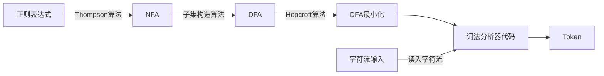

词法分析也称为**分词**，此阶段编译器从左向右扫描源文件，将其字符流分割成一个个的**词**（token、记号，后文中将称为token）。所谓**token**，就是源文件中不可再进一步分割的一串字符，类似于英语中单词，或汉语中的词。

### 词法分析程序（Lexical Analyzer）的要求

+ 从左至右扫描构成源程序的字符流
+ 识别出有词法意义的单词（Lexemes）
+ 返回单词记录（单词类别，单词本身）
+ 滤掉空格
+ 跳过注释
+ 发现词法错误

分词扫描的方法有直接扫描法和正则表达式匹配扫描法，下面先介绍直接扫描法。

### 词法分析器有两大类实现方案：

1. 手动构造

+ 复杂，容易出错（毕竟一种语言的规则通常都比较多）
+ 比较可控，是主流的方案（GCC、LLVM 等采用此办法）
+ 状态转换图：**状态转换图(简称为状态图)通过描绘系统的状态及引起系统状态转换的事件，来表示系统的行为。此外，状态图还指明了作为特定事件的结果系统将做哪些动作。**
+ 状态转换图是一张有限方向图
  + 节点代表状态，用圆圈表示
  + 状态之间用箭弧连结，箭弧上的标记（字符）代表射出结状态下可能出现的字符或字符类
  + 一张转换图只包含有限个状态，其中一个为初态，至少一个为终态。

- 状态：表示在识别词素的过程中可能出现的情况

  1. 状态看作是已处理部分的总结
  2. 某些状态为接受状态或最终状态，表明已找到词素
  3. 加上*的接受状态表示最后读入的符号不在词素中
  4. 开始状态用start边表示

- 边（edge)：从一个状态指向另一个状态；边的标号是一个或者多个符号。

  

2. 自动构造

+ 构造速度快，工作量少（可以搞个 demo）
+ 细节难以控制

这里先介绍手动构造的方法。

手动构造

### 手动构造

手动编写词法分析器要比使用自动生成工具要麻烦，因为大多数词法不复杂的语言的都可以通过正则表达式来表示词法单元。手动编写还需要模拟正则表达式，而自动生成工具就不需要。
手写可以基于状态转换图，或者直接扫描输入串来寻找模式匹配。

手动编写可以将正则表达式的模式转化为状态转换图，状态转换图有一组"状态"的节点。词法分析在扫描输入串的过程中寻找模式匹配的词素，而转换图中每个状态代表一个可能在这个过程中出现的情况。
状态图中的边从图的一个状态指向另一个状态，边上包含一个或多个符号，从一个节点经过一个边如果匹配则进入下一个节点，否则判断下一条边是否匹配。如果遇到一个终止状态则返回一个词法单元。

基于状态转换图的词法分析器的结构:
用一个变量state来表示当前状态节点的编号，然后用一个switch语句根据state的值来判断进入了哪个状态节点。

上下文无关文法：一种用于描述程序设计语言语法的表示方法。简称文法，文法自然地描述了大多数程序设计语言构造的层次化语法结构。

一个上下文无关文法由四个元素组成：

1. 终结符合集合，有时也称“词法单元”，终结符号是该文法所定义的语言的基本符号的集合。
2. 非终结符合集合，有时也称“语法变量”，每个非终结符号表示一个终结符号串的集合。
3. 产生式集合
4. 指定一个非终结符合为开始符号

如果要手动地实现词法分析器， 首先建立起每个词法单元的词法结构图或其他描述会有所帮助。

[基于状态转换图的词法分析器-Alex_Liu-ChinaUnix博客](http://blog.chinaunix.net/uid-69935732-id-5822671.html)

文法————>状态转换图

### 自动生成

在自动生成的方式下，只需要输入一些声明式的规范，然后经过自动生成器，就可以产生词法分析器的代码。

声明式的规范使用正则表达式来描述。

词法分析器的代码使用有限状态自动机。分为确定有限状态自动机（DFA）和不确定有限状态自动机（NFA）。

整个流程是从正则表达式转化为NFA，NFA转化为DFA，DFA最小化，最后生成词法分析器的代码。

- 正则表达式–>NFA：Thompson算法
- NFA–>DFA：子集构造算法
- DFA最小化：Hopcroft算法
- DFA–>词法分析器代码：转移表、哈希表、跳转表

词法分析阶段会用到以下几个数学工具：

正则表达式（Regular Expression, RE）

确定性有限状态自动机（DFA）

非确定性有限状态自动机（NFA）

手工构造词法分析器的步骤如下，我们通过 RE 来实现对 Token 的描述：

